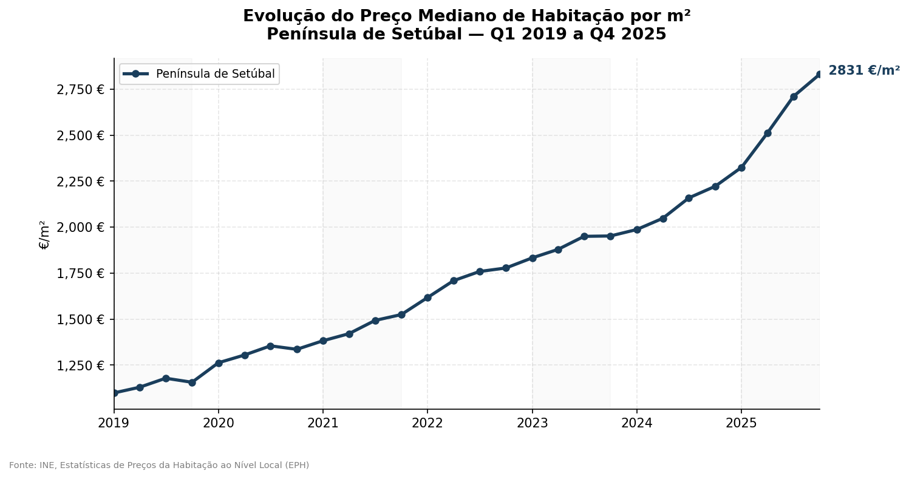
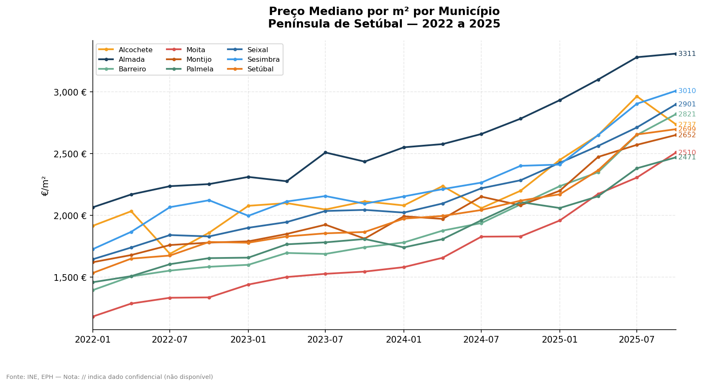
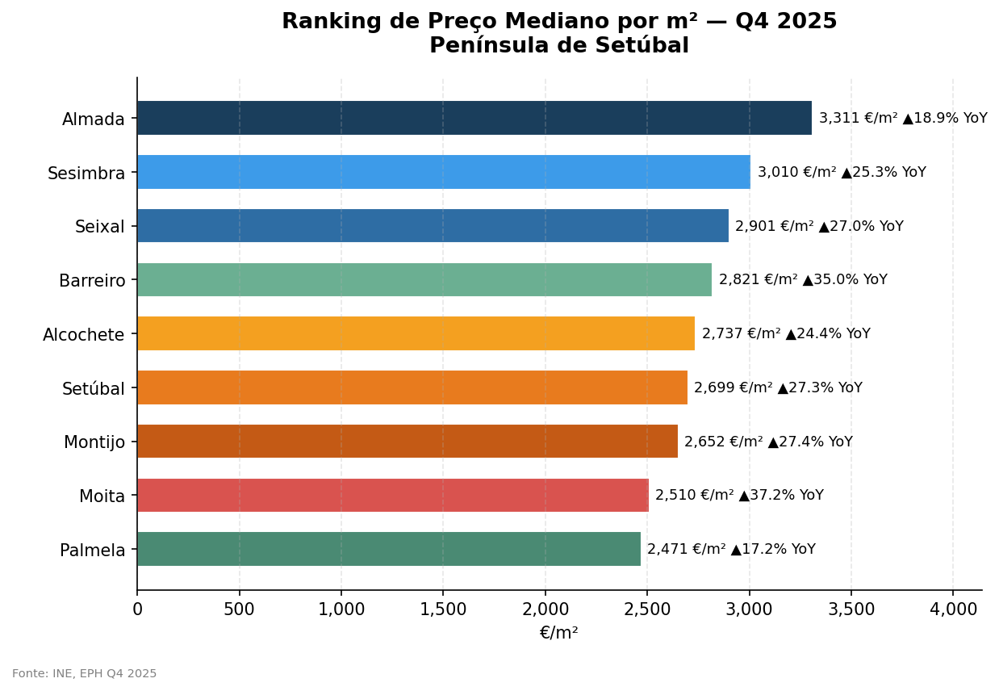
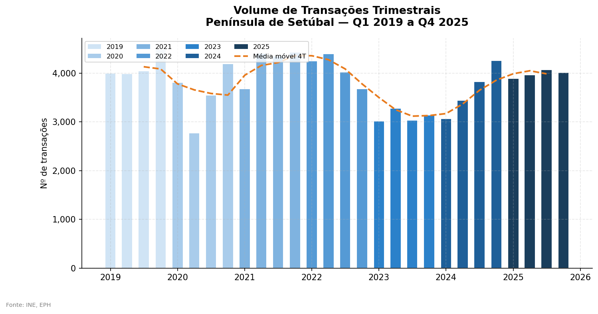
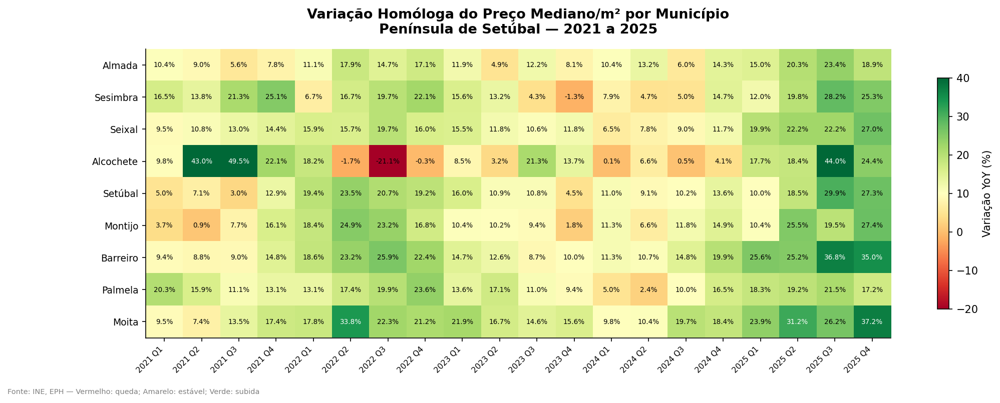
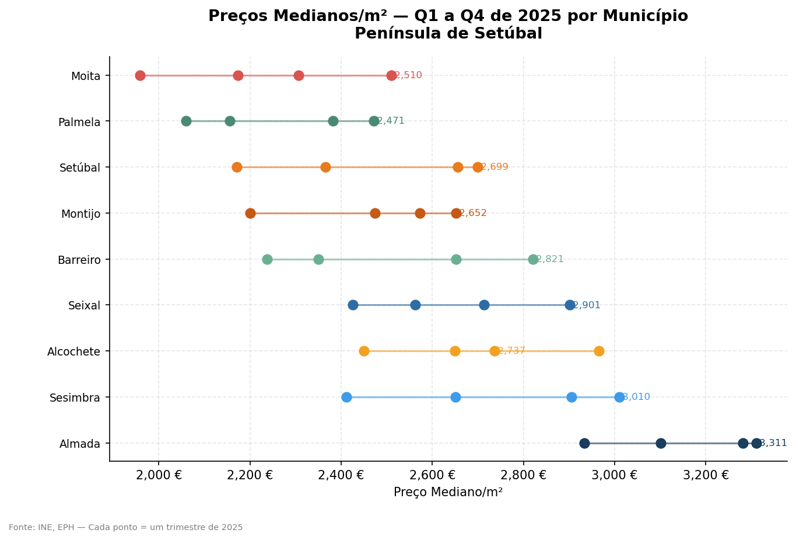

# Portugal Real Estate Intelligence

Data infrastructure, analysis pipelines and market reports for the Portuguese real estate ecosystem — built from public sources (INE), processed in Python/DuckDB, visualised in Power BI and published as PDF dossiers.

> Built by **LUXAR** — data, AI and automation for real estate professionals.

---

## Latest Release — Dossier de Mercado | Península de Setúbal

**[Download PDF →](outputs/LUXAR_Dossier_Mercado_Setubal_v1.pdf)** · v1.0 · May 2026 · 10 pages

A full quarterly market intelligence report covering 9 municipalities in the Setúbal Peninsula (NUTS 1B), from Q1 2019 to Q4 2025.

| | |
|---|---|
|  |  |
| **Sub-region price series 2019–2025** | **Per-municipality evolution 2022–2025** |
|  |  |
| **Municipality ranking — Q4 2025** | **Transaction volume with 4-quarter moving average** |
|  |  |
| **Year-on-year variation heatmap** | **Intra-2025 price distribution** |

### Key findings — Q4 2025

| Municipality | Median €/m² | YoY change |
|---|---|---|
| Almada | 3,311 € | +18.9% |
| Sesimbra | 3,010 € | +25.3% |
| Seixal | 2,901 € | +27.0% |
| Barreiro | 2,821 € | +35.0% |
| Alcochete | 2,737 € | +24.4% |
| Setúbal | 2,699 € | +27.3% |
| Montijo | 2,652 € | +27.4% |
| Moita | 2,510 € | +37.2% |
| Palmela | 2,471 € | +17.2% |

The sub-region recorded a median price of **2,831 €/m²** in Q4 2025 — up **+121%** since Q1 2019 and accelerating (+27.4% YoY).

---

## National Dashboard — Power BI

Three pages tracking the Portuguese residential market from 2009 to Q4 2025.

### Transaction Value (€ billions/quarter)

- Post-crisis low: 2013–2014
- Q4 2025: ~€10.8 billion

### Transaction Volume (units/quarter)

- Crisis low: ~14,000/quarter (2013)
- Q4 2025: ~43,000 transactions

### House Price Index — Annual % change

- Q4 2025: +4.0% YoY (sustained positive growth)

---

## Data Sources

| Dataset | Source | Period | Granularity |
|---------|--------|--------|-------------|
| EPH — Median price/m² by municipality | INE — Estatísticas de Preços da Habitação ao Nível Local | 2019 Q1 – 2025 Q4 | Quarterly × municipality |
| EPH — Transaction volume by municipality | INE — EPH | 2019 Q1 – 2025 Q4 | Quarterly × municipality |
| Transaction value (€) | INE — Housing Price Index | 2009 Q1 – 2025 Q4 | Quarterly × NUTS II |
| Transaction volume (N.º) | INE — Housing Price Index | 2009 Q1 – 2025 Q4 | Quarterly × NUTS II |
| House Price Index (% YoY) | INE — Housing Price Index | 2024 Q4 – 2025 Q4 | Quarterly |

All data from [www.ine.pt](https://www.ine.pt) — free, public, no authentication required.

---

## Repository Structure

```
├── scripts/
│   ├── 01_processar_ine_eph_setubal.py   # ETL pipeline — INE EPH → Parquet/CSV
│   ├── 02_graficos_setubal.py             # Matplotlib charts → PNG
│   └── 03_dossier_pdf_setubal.py          # PDF report generator (ReportLab)
│
├── raw/
│   ├── setup_dados_setubal.sh             # Downloads INE EPH source files
│   ├── 2026-05_ine_*.csv                  # National INE exports (NUTS level)
│   └── explorar_ine_*.py                  # Exploratory scripts
│
├── processed/
│   ├── ine_eph/
│   │   ├── ine_eph_setubal_trimestral.parquet          # All territories (308 rows)
│   │   ├── ine_eph_setubal_trimestral.csv
│   │   ├── ine_eph_setubal_municipios_trimestral.parquet  # Municipalities only (252 rows)
│   │   └── ine_eph_setubal_municipios_trimestral.csv
│   ├── 2026-05_ine_iph_limpo.csv
│   ├── 2026-05_ine_transacoes_alojamentos_familiares_limpo.csv
│   └── 2026-05_ine_transacoes_numero_alojamentos_familiares_limpo.csv
│
├── outputs/
│   ├── LUXAR_Dossier_Mercado_Setubal_v1.pdf
│   └── graficos_setubal/                  # 6 publication-ready PNGs
│
├── screenshots/                           # Power BI dashboard previews
└── Dashboard_Imobiliario_Portugal.pbix    # Power BI file
```

---

## Processed Dataset Schema — EPH Municipality Data

| Column | Type | Description |
|--------|------|-------------|
| `cod` | str | INE/NUTS territory code (e.g. `1B01503`) |
| `designacao` | str | Territory name |
| `data` | date | First day of the quarter (e.g. `2025-10-01`) |
| `ano` | int | Year |
| `trimestre` | int | Quarter (1–4) |
| `preco_mediano_m2` | float | Median sale price per m² (€) |
| `n_transacoes` | float | Number of transactions |
| `tipo_territorio` | str | `município` or `sub-região` |
| `periodo` | str | Human-readable label (e.g. `2025 Q4`) |
| `preco_yoy_pct` | float | Year-on-year price change (%) |
| `preco_qoq_pct` | float | Quarter-on-quarter price change (%) |
| `transacoes_yoy_pct` | float | Year-on-year transaction volume change (%) |

---

## Reproducing the Analysis

```bash
# 1. Download source data from INE
bash raw/setup_dados_setubal.sh

# 2. Run ETL pipeline
python scripts/01_processar_ine_eph_setubal.py

# 3. Generate charts
python scripts/02_graficos_setubal.py

# 4. Build PDF dossier
python scripts/03_dossier_pdf_setubal.py
```

**Requirements:** Python 3.11+, pandas, openpyxl, duckdb, matplotlib, reportlab

```bash
pip install pandas openpyxl duckdb matplotlib reportlab
```

---

## Stack

- **Python** — pandas, openpyxl, DuckDB, matplotlib, ReportLab
- **Power BI Desktop** — national market dashboard
- **Git + GitHub** — versioning and publication

---

## About LUXAR

LUXAR delivers data intelligence and automation to real estate professionals in Portugal — from independent brokers to regional franchises.

**Contact:** tiago@luxar.pt · [luxar.pt](https://luxar.pt)
