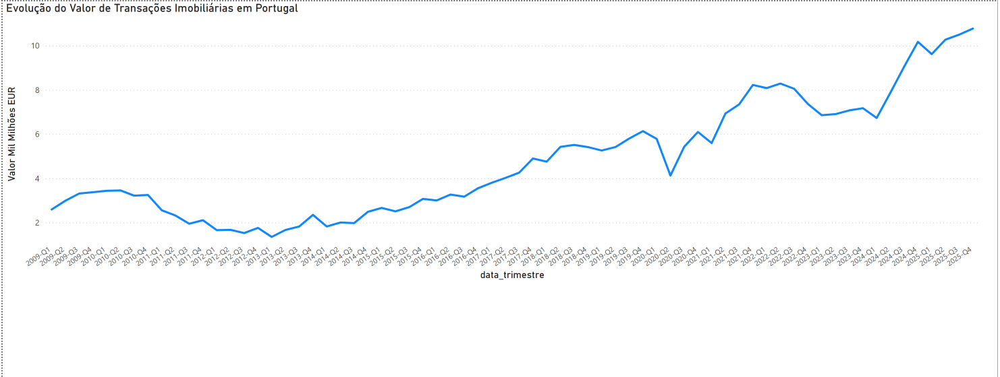
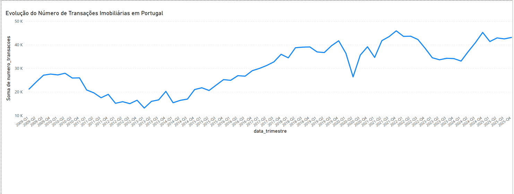
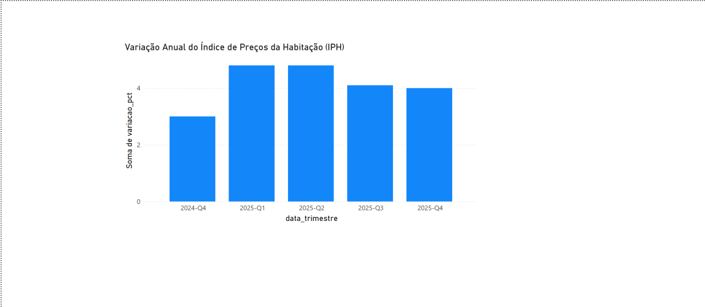

# Portugal Real Estate Intelligence

Data infrastructure and dashboards for the Portuguese real estate market — built from public sources (INE), cleaned with Python, and visualised in Power BI.

---

## Dashboards

Three pages tracking the Portuguese real estate market from 2009 to 2025:

### 1. Transaction Value — Total value of residential property transactions (€ billions)



- Market bottomed out during the sovereign debt crisis (2013–2014)
- Strong recovery from 2015 onwards
- Q4 2025: ~€10.8 billion transacted in a single quarter

### 2. Transaction Volume — Number of residential property transactions



- Crisis low: ~14,000 transactions/quarter (2013)
- COVID dip clearly visible in Q2 2020
- Q4 2025: ~43,000 transactions/quarter

### 3. House Price Index (IPH) — Annual % change in house prices



- Q1–Q2 2025: +4.8% year-on-year
- Q4 2025: +4.0% (slight deceleration, still positive)

---

## Data Sources

| Dataset | Source | Period | Granularity |
|---------|--------|--------|-------------|
| Transaction Value (€ thousands) | INE — Housing Price Index | 2009 Q1 – 2025 Q4 | Quarterly × NUTS II |
| Transaction Volume (N.º) | INE — Housing Price Index | 2009 Q1 – 2025 Q4 | Quarterly × NUTS II |
| House Price Index (% YoY) | INE — Housing Price Index | 2024 Q4 – 2025 Q4 | Quarterly |

All data downloaded from [www.ine.pt](https://www.ine.pt) — free, public, no authentication required.

---

## Repository Structure

```
├── raw/                    # Original INE exports (CSV, semicolon-separated)
│   ├── 2026-05_ine_iph_variacao_trimestral.csv
│   ├── 2026-05_ine_transacoes_alojamentos_familiares_nuts.csv
│   ├── 2026-05_ine_transacoes_numero_alojamentos_familiares_nuts_correto.csv
│   ├── explorar_ine_iph.py
│   ├── explorar_ine_transacoes.py
│   └── explorar_ine_transacoes_numero.py
│
├── processed/              # Clean CSVs ready for analysis or Power BI
│   ├── 2026-05_ine_iph_limpo.csv
│   ├── 2026-05_ine_transacoes_alojamentos_familiares_limpo.csv
│   └── 2026-05_ine_transacoes_numero_alojamentos_familiares_limpo.csv
│
├── screenshots/            # Dashboard previews
│   ├── dashboard_valor_transacoes.png
│   ├── dashboard_numero_transacoes.png
│   └── dashboard_iph_variacao.png
│
└── Dashboard_Imobiliario_Portugal.pbix   # Power BI dashboard (3 pages)
```

---

## Processed Dataset Schema

All processed files share the same structure:

| Column | Type | Description |
|--------|------|-------------|
| `periodo` | text | Original Portuguese period label |
| `localizacao` / `categoria` | text | NUTS II region or IPH category |
| `valor_milhares_eur` / `numero_transacoes` / `variacao_pct` | number | Metric value |
| `ano` | int | Year |
| `trimestre_num` | int | Quarter number (1–4) |
| `periodo_ordem` | int | Sort key (YYYYQ format, e.g. 20091) |
| `data_trimestre` | text | Readable period label (e.g. "2009-Q1") |

---

## Stack

- **Python + Pandas** — data cleaning and transformation
- **Power BI Desktop** — dashboards and visualisation
- **DuckDB** — local SQL analysis

---

## Key Insight

The Portuguese real estate market in 2025 is transacting at **4× the volume value** compared to the post-crisis lows of 2013, with prices still rising ~4% year-on-year. Volume (~43K transactions/quarter) has stabilised after the 2021–2022 boom peak.

---

## Contact

Built by **Tiago Antunes** — data, AI and automation for the Portuguese real estate ecosystem.

[github.com/tiagoantunes-data](https://github.com/tiagoantunes-data)
